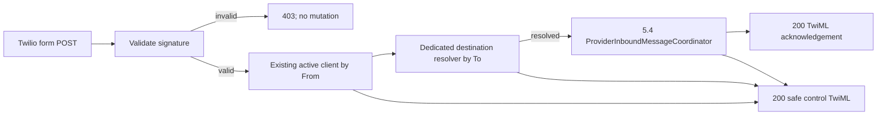

## Provider-edge design

The new route is a narrow synchronous form endpoint, e.g.
`POST /webhooks/twilio/whatsapp/inbound`. It receives a Starlette `Request`
and form fields, but passes no request object beyond the adapter. The adapter
constructs the exact validation URL from required `TWILIO_WEBHOOK_BASE_URL`
plus the route path and query string; it does not trust host/proto forwarding
headers. It calls Twilio SDK `RequestValidator.validate(url, form_params,
signature)` before normalization, database access, client lookup, channel
resolution or core processing.

`TWILIO_AUTH_TOKEN` and `TWILIO_WEBHOOK_BASE_URL` are required only for this
new ingress. Empty/missing/invalid configuration makes this endpoint fail
closed with `403`; it must not prevent unrelated local API startup. The base
URL must be absolute HTTPS and contain no query/fragment. Tests inject settings
or a validator seam, never a real token.

## Translation flow



The adapter requires non-empty string `MessageSid`, `From`, `To`, and `Body`.
`MessageSid` is the opaque Phase-5.4 receipt identity. `From` and `To` accept
Twilio's `whatsapp:` envelope and are normalized using the existing WhatsApp
normalizer. `Body` is passed byte-for-byte to the Phase-5.4 command after only
its existing non-empty validation. Any malformed required field is a validly
signed business rejection with safe control TwiML, never an unsigned or
partially processed command.

The client must already exist and be active. The adapter/resolver must use the
existing client repository/service boundary rather than query an HTTP route.
For an active dedicated resolution, only its exact `channel_id` and
`comercio_id` can enter the coordinator. `requires_shared_routing` is a
non-processing control reply; no 5.2/5.3 state is changed in this phase.

## TwiML and failure semantics

TwiML is rendered with the Twilio SDK response builder, not hand-assembled
XML. It has three intentionally small shapes:

| State | Response |
| --- | --- |
| First committed processing | `200 application/xml` acknowledgement message, no business-response replay contract |
| Duplicate receipt | `200 application/xml` empty `<Response/>` |
| Safe pre-core/invalid-context business state | `200 application/xml` generic control message without internal ids or error details |

The first-processing acknowledgement is emitted only after `process()` returns
`processed`, hence after its commit. It is not recorded in the receipt and no
attempt is made to re-send it on a duplicate. Exceptions from signature
validation plumbing, database/core processing or TwiML rendering propagate;
the endpoint does not translate them into `already_processed` or a business
fallback.

## Invariants

- The signature validator receives the externally configured canonical URL,
  all submitted form parameters and the raw signature header; it is never
  bypassed in production code.
- Invalid/missing signatures perform zero database/client/resolver/core calls.
- The route does not call transaction-control methods and invokes no pipeline
  except through the 5.4 coordinator.
- A duplicate invokes no pipeline or session creation and returns empty TwiML.
- A shared destination never selects a commerce or invokes the coordinator.
- A valid message cannot be routed by client identity alone, destination alone,
  any client/commercial id supplied by the provider, or a stale 5.3 pending
  target.
- Raw body/signature/token are absent from outcome/log/HTTP diagnostic text.

## Focused tests

1. A correctly signed dedicated message maps `MessageSid`/`From`/`To`/`Body`
   into exactly one Phase-5.4 command and returns acknowledgement TwiML only
   for `processed`.
2. Tampered body, URL, form parameter or missing signature returns `403` and
   proves no database/core calls.
3. Missing/malformed required provider fields, unknown/inactive client,
   invalid/unknown/inactive destination, unavailable commerce and shared
   destination return safe `200` control TwiML with no core call.
4. `already_processed` yields exact empty TwiML and proves no response replay;
   `invalid_context` yields safe control TwiML with no fallback.
5. Coordinator technical exceptions remain `5xx`; adapter/router does not
   commit/rollback/flush or catch them as business outcomes.
6. Settings reject malformed enabled ingress values and static module-boundary
   tests pin SDK, HTTP and transaction responsibilities.

## Validation

```bash
PYTHONPATH=. venv/bin/pytest -q backend/tests/test_twilio_inbound_adapter.py backend/tests/test_twilio_webhook.py backend/tests/test_llm_settings.py backend/tests/test_provider_message_receipt_core.py
PYTHONPATH=. venv/bin/python -m ruff check backend/config/settings.py backend/services/twilio_inbound_adapter.py backend/routers/twilio_webhook.py backend/main.py backend/tests/test_twilio_inbound_adapter.py backend/tests/test_twilio_webhook.py
PYTHONPATH=. venv/bin/python -m compileall backend/config/settings.py backend/services/twilio_inbound_adapter.py backend/routers/twilio_webhook.py backend/main.py backend/tests/test_twilio_inbound_adapter.py backend/tests/test_twilio_webhook.py
openspec validate add-twilio-inbound-webhook-5-5 --strict
git diff --check
```
