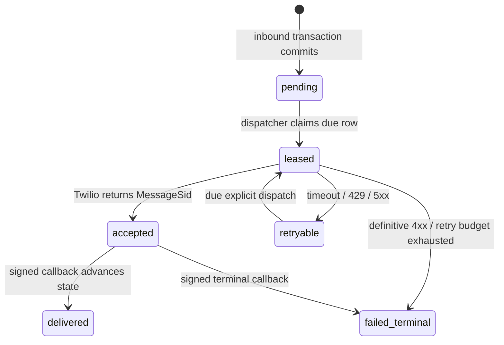

## Decision

Phase 5.6 introduces one `OutboundProviderMessage` outbox (final Spanish model
name may follow repository convention). It is created only from the results of
a first, valid Phase-5.4 inbound processing. The row is the sole replayable
artifact: it stores the immutable canonical destination, rendered response body,
provider, inbound receipt foreign key and a zero-based `sequence` unique per
receipt. It contains dispatch state, lease token/expiry, attempt count,
next-attempt timestamp, Twilio SID, the last safe failure category/code and
provider-status timestamp. It never stores Twilio credentials, signatures or
raw provider callback payloads.

`ProviderInboundMessageCoordinator` continues to own one transaction. After
the existing non-transactional pipeline returns `ProcessedIntent`s, it invokes
a non-transactional response mapper which preserves the current local response
semantics (`agregar`, `quitar`, `modificar`, generic). The mapper stages ordered
outbox rows before the coordinator's existing commit. The local endpoint uses
the same mapper after its successful compatibility transaction but does not
persist outbound rows, so it keeps returning its existing JSON responses.

Phase 5.5 returns empty TwiML for a first committed receipt as it does for a
duplicate: the durable outbox, rather than TwiML, is the delivery contract.

## State machine and retries



Claiming uses a database-supported conditional update/row lock and a random
lease token. It selects only `pending`/`retryable` rows whose `next_attempt_at`
is due and excludes currently leased rows. Finalization requires the matching
lease token, so a late network result cannot overwrite a later attempt. The
sender passes an idempotency key derived from the stable outbox id to Twilio
when the SDK/API supports it; this lowers ambiguity but does not promise
exactly-once remote delivery.

Retryable failures are transport errors, HTTP 429 and provider 5xx. Backoff is
fixed and bounded by configuration (`initial_seconds`, `max_seconds`,
`max_attempts`); jitter is deliberately excluded for deterministic focused
tests. Invalid destination/auth/configuration and other definitive 4xx results
are terminal and do not retry. An ambiguous timeout is retryable. A row with a
Twilio SID is never resent solely because its callback has not arrived.

## Twilio adapter and callback

The adapter converts one claimed row into a Twilio REST API request using only
the configured account/auth settings, its stored `to` destination and its
configured sender. It requests the configured absolute HTTPS callback URL. It
returns a typed accepted/retryable/terminal result; it does not import models,
repositories, FastAPI or transaction control.

`POST /webhooks/twilio/whatsapp/status` validates `X-Twilio-Signature` with
the same canonical base-URL discipline as 5.5 and the complete form/query
string. It accepts only a non-empty `MessageSid` and `MessageStatus` after
validation. The callback service locates by `(provider="twilio", provider_sid)`
and accepts only monotonic transitions such as `accepted -> sent -> delivered`
or a terminal failed/undelivered state. Duplicate, stale, malformed-valid or
unknown callbacks are idempotent no-ops with `204`; invalid/missing signature
returns `403` before database access. Callback data never changes body,
destination, attempt counts or retry eligibility.

## Invariants

- A committed first inbound receipt and all of its outbox rows are atomic; a
  rollback leaves neither durable.
- A duplicate receipt creates no row and does not reconstruct/send a response.
- The 5.4 coordinator remains the only owner of its inbound transaction.
- Exactly one response sequence is staged per processed intent, in source
  order; the generic fallback stays equivalent to the current local endpoint.
- Dispatch network I/O happens outside the database claim transaction and no
  lease allows two active finalizers for the same attempt.
- Callback signatures are validated before any lookup; callbacks are monotonic
  and cannot resurrect a terminal state or schedule a retry.
- No transport adapter or callback selects commerce, creates sessions, calls a
  recognizer/classifier/handler, or calls the inbound coordinator.

## Focused tests

1. A successful first 5.4 processing commits ordered rows atomically with its
   receipt and matching session; rollback produces neither.
2. A duplicate receipt invokes no response mapper and creates no row.
3. The local endpoint still returns the same response list and creates no
   provider outbox row.
4. The dispatcher claims one due row, calls the Twilio seam once, stores the
   returned SID and cannot send an active lease twice.
5. Transport/429/5xx produce bounded retryable rows; definitive 4xx and budget
   exhaustion are terminal; a row with an existing SID is not resent.
6. Valid signed callbacks advance only permitted states; invalid signatures
   make zero database calls; stale/duplicate/unknown callbacks are no-ops.
7. Static boundaries pin transaction ownership, forbid raw body/secrets in
   logs/outcomes and prove 5.5 no longer embeds business output in TwiML.

## Validation

```bash
PYTHONPATH=. venv/bin/pytest -q backend/tests/test_provider_message_receipt_core.py backend/tests/test_provider_outbound_message_outbox.py backend/tests/test_twilio_outbound_dispatcher.py backend/tests/test_twilio_delivery_callback.py backend/tests/test_twilio_webhook.py backend/tests/test_incoming_messages_endpoint.py backend/tests/test_llm_settings.py
PYTHONPATH=. venv/bin/python -m ruff check backend/config/settings.py backend/models backend/repositories backend/services backend/routers/twilio_webhook.py backend/routers/twilio_delivery_callback.py backend/intents/orchestration backend/tests/test_provider_outbound_message_outbox.py backend/tests/test_twilio_outbound_dispatcher.py backend/tests/test_twilio_delivery_callback.py
PYTHONPATH=. venv/bin/python -m compileall backend/config/settings.py backend/models backend/repositories backend/services backend/routers/twilio_webhook.py backend/routers/twilio_delivery_callback.py backend/intents/orchestration backend/tests/test_provider_outbound_message_outbox.py backend/tests/test_twilio_outbound_dispatcher.py backend/tests/test_twilio_delivery_callback.py
openspec validate add-twilio-outbound-delivery-5-6 --strict
git diff --check
```
