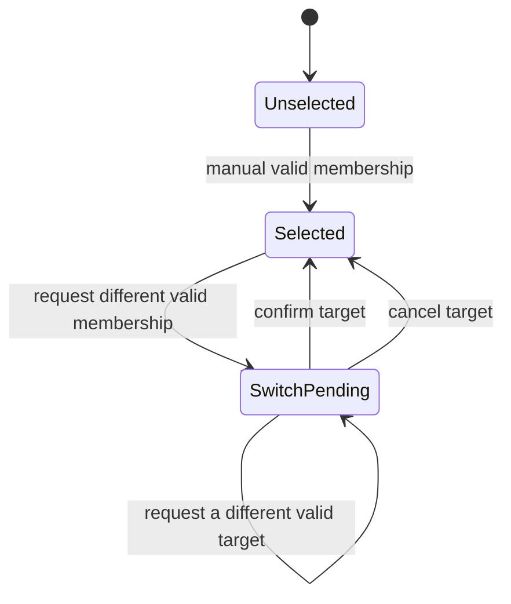

## Context

Phase 5.3 extends only the durable pre-commerce context created in 5.2. The
context remains keyed by `(canal_id, cliente_id)` and remains separate from
`Session`; it cannot invoke the order pipeline because no provider receipt or
single transaction exists until Phase 5.4.

## Persistence

Add nullable `comercio_id_cambio_pendiente` to
`ContextoClienteCanalWhatsapp`, with a restrictive foreign key to `comercios`
and an index. It is a proposed target, never an authority for processing.
`comercio_id_seleccionado` remains the authoritative selection until explicit
confirmation. No new table is warranted: there can be one context and at most
one requested switch per channel/client.

## Service operations

| Operation | Preconditions | Mutation | Success outcome |
| --- | --- | --- | --- |
| `list_manual_options` | active client + active shared channel | none | `options_available` |
| `select_manual` | no selected commerce; target is active membership of channel and its commerce is active | selected commerce; preserve message; clear pending target | `selected` |
| `request_switch` | existing selected commerce differs from validated active membership commerce | set pending target only; preserve selected commerce/message | `switch_requested` |
| `confirm_switch` | a pending target exists and is still an active membership of the same channel with active commerce | move pending target to selected; clear target; preserve message | `switch_confirmed` |
| `cancel_switch` | a pending target exists | clear target only; preserve selected commerce/message | `switch_cancelled` |

An operation always validates `Cliente.activo`, `CanalWhatsapp.activo`, shared
mode, and channel-scoped membership. Options contain only active memberships
whose commerces are active; their public choice key is `membership_id`, never
an arbitrary commerce id. A no-op selection of the current commerce returns
`already_selected` and clears no pending target. A request for the current
commerce likewise never creates a pending switch.

## State transitions

The replacement transition is explicit. No invalid input, unavailable
commerce, inactive channel/client, absent target, or stale/revoked target may
change selection, target, or pending original text. A stale target on confirm
returns `unknown_or_inactive_membership` or `unavailable_commerce` and remains
pending; the caller can explicitly cancel it. This fail-closed behaviour avoids
both accidental switching and message loss.

## Boundaries and transaction ownership

The existing repository gains only scoped reads of active memberships and
staged context attribute updates. The service does not call `commit`,
`rollback`, `begin`, `flush`, `close`, or any classifier/recognizer/handler/
catalog/session/order API. It does not catch database exceptions or infer
idempotency; Phase 5.4 owns those concerns.

## Tests and validation

Focused tests must cover active channel isolation, no-selection manual choice,
same-choice idempotency, request/confirm/cancel lifecycle, target replacement,
stale target fail-closed behaviour, original-message preservation, active
client/commercial validation, and static transaction/pipeline boundaries.
