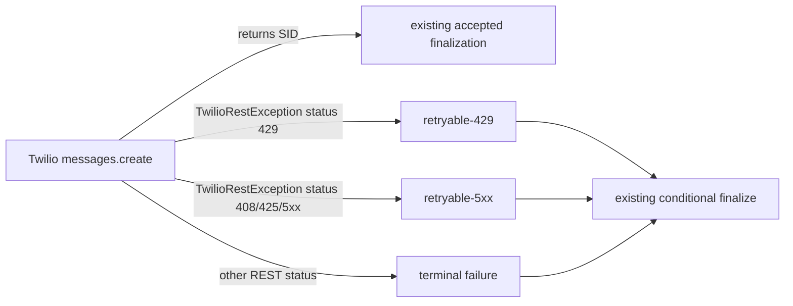

## Decision

At the Twilio adapter boundary, import and catch the real
`twilio.base.exceptions.TwilioRestException` from the pinned `twilio==9.10.9`
dependency. Read its HTTP `status` defensively as an integer for retry
classification. Retain its numeric `code`, if supplied, only as the existing
safe result code; do not include `msg`, `uri`, `details` or `str(exception)`
in any result or log.

The adapter's mapping is:

| SDK exception status | Adapter result |
| --- | --- |
| `429` | `RETRYABLE` / `RETRYABLE_429` |
| `408`, `425`, `500`, `502`, `503`, `504` | `RETRYABLE` / `RETRYABLE_5XX` |
| Other present REST status | `TERMINAL` / `TERMINAL_4XX` |

The existing custom `_TwilioAPIError` is removed or made unnecessary in the
adapter and its tests. `_TwilioTransportError` remains unchanged because this
change does not widen the observed REST-exception fix into transport error
taxonomy.

## Rationale

`TwilioRestException` is what the deployed SDK actually raised. Its `code` is
a Twilio product error identifier, whereas HTTP retry semantics are determined
by `status`. Catching only the private marker made production REST failures
escape before conditional finalization. Catching the specific real exception
restores the designed adapter boundary without hiding `TypeError` or unrelated
runtime defects.

## Runtime behavior

The dispatcher still commits the claim before calling the adapter, and
finalizes only through the matching lease token after the typed result. An
unexpected exception still propagates to the CLI; it is not silently converted
to a retry/terminal result.

## Invariants

- The network call stays outside a SQLAlchemy session.
- `TwilioRestException.status`, not `.code`, determines retryability.
- A numeric `.code` may be carried as the existing sanitized code field but
  never controls retry policy.
- `TypeError`, configuration mistakes and exceptions other than the explicit
  supported categories remain visible technical failures.
- Existing accepted, backoff, retry budget, lease-expiry recovery and callback
  behavior do not change.
- No raw provider exception content reaches output, logs or persistence.

## Focused test design

Use a local `TwilioRestException` construction with synthetic safe values and
an injected messages seam; never call Twilio. Add or replace tests that prove:

1. HTTP 429 produces `RETRY_SCHEDULED` with retryable-429 and the numeric
   provider code is forwarded only as the safe code;
2. HTTP 5xx produces `RETRY_SCHEDULED` with retryable-5xx;
3. HTTP 4xx produces `FAILED_TERMINAL` and preserves no exception message;
4. the existing strict normal-send seam and accepted finalization still pass;
5. a `TypeError` still escapes rather than being misclassified.

The tests may inspect typed result fields and mocked repository calls, but
must not assert or print raw exception strings, bodies, addresses or tokens.

## Operational follow-up

After approved implementation, reviewed local validation and deployment, wait
for the current lease to expire and invoke exactly one bounded dispatch pass.
If it yields `failed_terminal`, retrieve only the Twilio Console error code
and category/timestamp to decide a distinct configuration remediation. If it
yields retryable, honor the existing backoff and do not manually loop.
