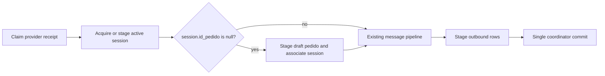

## Decision

Add a narrow draft-pedido prerequisite inside the existing provider inbound
coordinator, after the receipt has been claimed and the active session has
been acquired, and before calling the existing incoming-message pipeline.

## Detailed behavior

1. The coordinator keeps the existing authority checks and idempotent receipt
   claim unchanged. It performs no pedido work for invalid or duplicate
   receipts.
2. It calls the existing `SessionRepository.stage_active` exactly once.
3. If the returned active session has a non-null `id_pedido`, it makes no
   pedido mutation and proceeds exactly as today.
4. If `id_pedido` is null, the coordinator flushes the staged session only as
   required to obtain its database ID, asks a `PedidoRepository` staging helper
   to add one `Pedido` with that `id_session` and `estado_pedido=borrador`,
   flushes to obtain the pedido ID, and assigns that ID to the same session.
5. It then invokes the unchanged pipeline and outbox staging. The sole final
   commit makes all effects durable together.

The staging helper is deliberately a repository primitive: it creates no
service transaction and does not commit, roll back, or begin. The coordinator
is the only layer that flushes for generated IDs and remains the only commit /
rollback owner.

## Invariants

- A committed first valid provider receipt has one compatible active session
  and that session has a draft pedido before message processing.
- A session already associated with a pedido is not reassociated or given an
  additional pedido.
- A duplicate receipt produces no new session, pedido, pipeline, or outbox
  work.
- A technical failure after staging the pedido leaves no partial durable
  receipt, session, pedido, association, order line, or outbound row.
- Provider routing authority, message content handling, pending candidate
  scope, and response mapping do not change.

## Concurrency and failure handling

The existing unique receipt claim selects exactly one winner. Only that winner
can acquire/stage a session and draft pedido. A flush or later pipeline/outbox
failure uses the existing coordinator outer rollback, so the receipt claim and
any newly inserted rows are undone. A later provider retry can therefore claim
and process the receipt normally.

The existing active-session uniqueness invariant remains database-authoritative.
If a concurrent session creation conflicts during a required flush, that is a
technical failure under the current coordinator contract and rolls back as a
whole; this change does not add retry behavior.

## Test design

Unit tests use the current coordinator seams to verify ordering and no work on
duplicate/invalid paths. PostgreSQL integration tests use real models and the
coordinator to verify the persisted association and one `borrador` pedido for:

- a first receipt with no pre-existing session;
- an existing active session whose `id_pedido` is null;
- an existing session already associated with a draft pedido;
- a duplicate receipt; and
- a forced post-staging technical failure followed by a retry.

The focused agregar-producto regression demonstrates that the order
precondition is compatible with the existing pending-selection lifecycle; it
does not broaden recognizer or resolver behavior.
