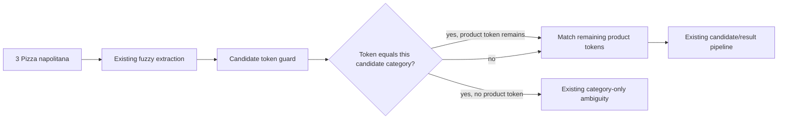

## Decision

Teach the existing key-token guard to distinguish a candidate's category token
from its product-identifying tokens. This is a filtering refinement, not a
candidate generator.

## Algorithm

For each extracted candidate, use the existing normalization and category
singular/plural variants to divide significant user tokens into:

- category-context tokens that match only that candidate's
  `categoria_nombre`; and
- product tokens, which must continue to match the candidate's normalized
  product name or existing normalized aliases under the current fuzzy
  threshold.

Ignore category-context tokens only if the request contains at least one
product token. If no product token remains, retain existing behavior: the
candidate does not pass this guard, allowing the existing category-only
ambiguity pass to provide the safe result. A category term that does not match
the candidate's category is never ignored.

For `3 Pizza napolitana` and `Napolitana` / `Pizzas` candidates, the normalized
tokens are `pizza`, `napolitana`; `pizza` is compatible category context and
`napolitana` proves product identity. Quantity extraction and presentation
selection run unchanged afterwards.

## Invariants

- The recognizer never creates candidates solely from a category token.
- Candidate IDs remain those produced by the existing fuzzy extraction and are
  only removed by filtering; no catalog-wide category expansion occurs.
- The candidate's own category is the only category that can be ignored as
  context.
- Existing aliases remain caller-projected authority; no static alias or
  catalog-data change is introduced.
- Fuzzy stays the safe fallback. Hybrid modes reuse this same fuzzy result and
  receive no separate policy change.
- The four top-level recognizer result keys and category-group discriminated
  union remain byte-compatible.

## Failure behavior

The refinement has no catch-all or external dependency. Inputs with no
product-identifying token, an incompatible category, unavailable products, or
no fuzzy candidate remain on the existing safe ambiguity/not-found paths.

## Test strategy

Use a small in-memory catalog containing `Napolitana` and unrelated `Pizzas`
and `Empanadas` entries. Assert exact returned IDs, quantity, group shape and
unmatched output for the four specified scenarios. Retain the established
category-only and persisted-alias regressions to demonstrate no broadening.
