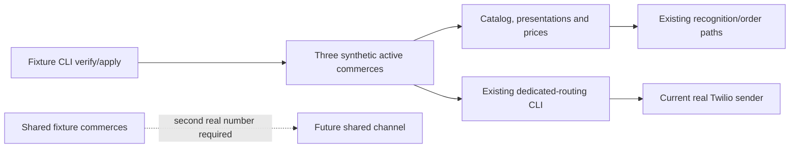

## Decision

Introduce a deterministic fixture boundary separate from both the legacy seed
orchestrator and the WhatsApp routing provisioner:

The fixture CLI does not create any `CanalWhatsapp` row. The current real
sender is bound only later, through the approved dedicated-routing CLI, to the
commerce fixture labelled `Piloto WhatsApp Dedicado`. The two shared-labelled
commerce fixtures intentionally have no channel or membership until a second
real destination is available.

## Fixture identities and catalog

Every fixture identity is stable and synthetic. Commerce selection is by
stable slug, not generated numeric IDs. The three commerce labels/slugs are:

| Label | Slug | Routing role now |
| --- | --- | --- |
| Piloto WhatsApp Dedicado | `piloto-whatsapp-dedicado` | Eligible for the current dedicated sender after separate provisioning |
| Piloto WhatsApp Compartido Uno | `piloto-whatsapp-compartido-uno` | Catalog fixture only |
| Piloto WhatsApp Compartido Dos | `piloto-whatsapp-compartido-dos` | Catalog fixture only |

Each commerce receives four categories (`Pizzas`, `Empanadas`, `Bebidas`,
`Postres`) and seven presentations (`grande`, `chica`, `unidad`, `lata`,
`litro`, `2-litros`, `kilo`). The same thirty-item, non-random catalog is
created for each commerce:

| Category | Products | Presentations |
| --- | --- | --- |
| Pizzas (8) | Mozzarella; Napolitana; Fugazzeta; Calabresa; Jamón y morrones; Cuatro quesos; Rúcula y crudo; Vegetariana | grande, chica |
| Empanadas (8) | Carne suave; Carne picante; Pollo; Jamón y queso; Humita; Verdura; Cebolla y queso; Caprese | unidad |
| Bebidas (7) | Cola clásica; Cola sin azúcar; Lima-limón; Naranja; Agua sin gas; Agua con gas; Cerveza rubia | lata, litro, 2-litros |
| Postres (7) | Helado chocolate; Helado vainilla; Helado dulce de leche; Flan casero; Tiramisú; Brownie; Ensalada de frutas | unidad, kilo |

This yields 59 active `ProductoPresentacion` rows and 59 prices per commerce,
for 177 of each across the three-commerce fixture set. Prices are a fixed,
versioned table keyed by category/product/presentation; they must not be
generated randomly or derived from numeric database IDs.

## Apply and verification contract

`--verify-only` is the default and performs only read queries. `--apply` is
the only mutating mode. The fixture definitions are static application data;
the command never opens, reads, exports, cleans, or compares against a local
database. Before first staging it requires all tables it owns (commerce state,
commerces, categories, presentations, products, product-presentations, and
prices) to be empty. An exact full fixture set returns `ready` in either mode
without mutation. An empty compatible fixture namespace returns `not_ready` in
verification and may return `provisioned` after explicit apply.

Any pre-existing row in an owned table before the first fixture apply, or any
stable slug/code/name whose immutable fixture shape differs from the defined
data, is a `conflict`; apply must not overwrite, repair, delete, or silently
merge it. This makes the CLI safe for an empty Railway database while avoiding
ownership of pre-existing business data. A local database with prior data is
therefore rejected rather than cleaned or reseeded.

The CLI opens one session and owns one transaction. Helpers do no transaction
control. It flushes at most once to make staged data visible to the final
verification, commits once only after that check succeeds, and rolls back on
every exception. It returns safe aggregate counts and stable slugs/numeric
IDs, never the configured database URL or caught exception text.

## Dependencies and boundaries

The creation order is: commerce state; commerces; categories and
presentations; products; product-presentations; prices. Existing models,
repositories and services are reused where they preserve the one-transaction
contract. No migration is allowed: a missing schema is a technical failure.

The legacy `setup_all` scripts remain unchanged and are not invoked. Their
target URL output and dataset scope make them unsuitable for this operator
surface. The fixture seeder also does not create clients; the existing
dedicated-routing CLI creates only the selected designated test client when
explicitly applied.

## Operational sequence

1. The operator runs fixture verification in Railway and keeps only sanitized
   status/count output.
2. If it is `not_ready` and the target has been confirmed as the intended
   empty Railway fixture database, the operator runs one explicit apply.
3. The operator repeats verification and proceeds only when it is `ready`.
4. The existing dedicated-routing CLI is verified/applied for the numeric ID
   returned for `piloto-whatsapp-dedicado` and the existing sender.
5. Shared-routing exercise remains unavailable until a separate approved
   change provisions a real second destination and two memberships.

## Validation and rollback

Focused tests verify counts, catalog relations, stable price coverage,
idempotency, no mutation in default mode, conflict refusal, transactional
rollback and output redaction. Ruff and compileall cover touched Python files;
strict OpenSpec validation and `git diff --check` cover the change.

No delete/reset command is introduced. Removing fixture data or replacing a
Railway database is an explicit operational action outside the CLI and requires
separate user approval.
