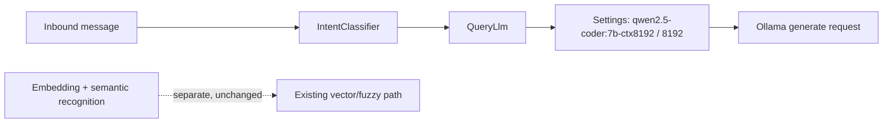

## Decision

Use the existing `Settings -> QueryLlm` boundary.  Change only the default
`LLM_MODEL` to `qwen2.5-coder:7b-ctx8192`; retain the existing default
`LLM_NUM_CTX=8192` and make both values explicit in tests.

No caller selects a model.  `IntentClassifier` continues to instantiate
`QueryLlm`, which reads `Settings` and emits exactly one Ollama JSON request.

## Runtime contract

| Condition | Effective model/context | Outcome |
| --- | --- | --- |
| No `LLM_MODEL` or `LLM_NUM_CTX` environment override | `qwen2.5-coder:7b-ctx8192` / `8192` | Existing JSON intent-classification request |
| Explicit environment override | Exact override values | Existing override behaviour, no source fallback |
| Semantic product recognition or embeddings | Existing independent settings | Unchanged |
| Ollama rejects/unavailable model | Existing typed QueryLlm error | No automatic model switch |

## Boundaries and invariants

- `QueryLlm` remains the only current non-semantic model client; no router or
  per-feature model abstraction is added.
- The request continues to use `stream=False`, `think=False`, `format="json"`,
  `temperature=0`, the configured `num_predict`, and `num_ctx=8192` by
  default.
- No semantic model, embedding configuration, recognition policy or candidate
  set may be modified.
- Tests use mocked transport/settings only; no Ollama endpoint or model is
  called or downloaded.
- No transaction, migration, webhook or deployment work belongs here.

## Test design

Extend the focused settings/query-client tests to assert:

1. default settings select the exact named model and 8192 context;
2. a mocked `QueryLlm` transport receives those values in the payload;
3. explicit environment overrides preserve current precedence; and
4. `IntentClassifier` injection/JSON validation contracts remain unchanged.

## Rollback

Restore the previous default in source, or set an explicit `LLM_MODEL`
environment override.  No data cleanup is needed.
