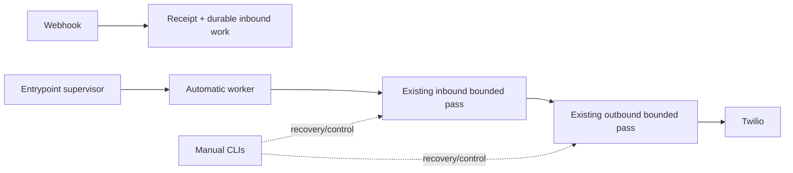

# Design: automatic provider processing worker

## Design decision

Use one opt-in in-process worker process, launched and supervised by the
existing `docker-entrypoint.sh`. It calls existing CLI `main()` seams in this
fixed order on every bounded cycle:

1. inbound processing pass;
2. outbound dispatch pass;
3. sleep for the configured positive interval.

This is the smallest deployment shape that reuses current lease, retry and
transaction boundaries. It adds no queue, web-request work, scheduler or
parallel provider adapter.

## Configuration and startup contract

New settings are strict and non-secret:

| Setting | Default | Meaning |
| --- | --- | --- |
| `PROVIDER_PROCESSING_WORKER_ENABLED` | `false` | Enables the worker child process. |
| `PROVIDER_PROCESSING_WORKER_POLL_INTERVAL_SECONDS` | `5` | Positive delay between completed cycles. |
| `PROVIDER_PROCESSING_WORKER_INBOUND_MAX_ITEMS_PER_PASS` | `1` | Positive bound forwarded to the existing inbound CLI. |
| `PROVIDER_PROCESSING_WORKER_OUTBOUND_MAX_ATTEMPTS_PER_PASS` | `16` | Positive bound forwarded to the existing outbound CLI. |

When disabled, the entrypoint starts exactly as it does today. When enabled,
the worker validates settings and required existing outbound configuration
before `uvicorn` begins serving. Invalid enablement/configuration is a startup
failure, not a silent manual fallback.

## Cycle behavior

The worker loads the typed settings once, invokes the existing inbound CLI with
the configured bound, then invokes the existing outbound CLI with its bound.
It catches no business/retry outcome: those are already represented as normal
CLI return values and durable work/outbox state. It sleeps after the two passes
regardless of whether either found due work.

Only an uncaught programming/runtime failure ends the worker process. The
entrypoint detects that exit, stops `uvicorn`, and exits non-zero so Railway
restarts the service. Existing lease expiry and conditional finalization are
the sole recovery mechanisms; the worker never steals or manually releases a
lease.

## Authoritative outcomes

| Situation | Required outcome | Must not happen |
| --- | --- | --- |
| Disabled flag | no worker process; manual CLIs remain available | implicit polling |
| Valid enabled cycle | inbound pass then outbound pass, each bounded | direct DB/Twilio work by the worker |
| No due work | log safe empty-cycle outcome and sleep | process termination or busy loop |
| Retryable/terminal row | existing CLI/repository behavior persists | duplicate attempt or changed retry policy |
| Invalid enabled config | startup fails before web traffic | silent disablement |
| Worker crash | entrypoint exits and Railway restarts; leases recover normally | app continues while automation is silently dead |

## Ordering, privacy, and limitations

The inbound coordinator's existing per-conversation order gate remains
authoritative. The worker intentionally does not add a global order gate for
outbound rows: provider acceptance/delivery across distinct receipts can still
be observed in a different customer-visible order. The worker logs derived
counts only; raw customer/provider content stays within existing transient or
outbox boundaries.

## Focused test design

- disabled configuration never launches the worker;
- enabled worker invokes inbound before outbound and forwards exactly the
  configured bounds;
- no-due/normal nonzero business outcomes continue to the next sleep;
- invalid positive settings fail during load/startup;
- unexpected worker exception reaches the supervisor path;
- worker output/logging contains no raw message or provider credentials;
- current inbound/outbound CLI tests remain green.
