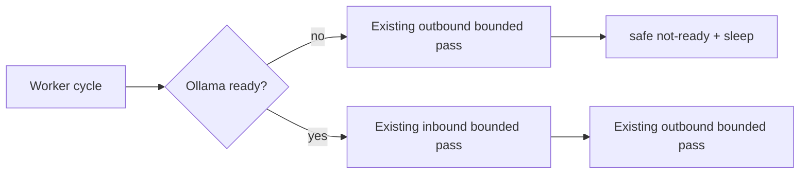

# Design: worker Ollama readiness gate

## Decision

Extract the controlled generate+embedding diagnostic into a reusable pure readiness seam. The worker keeps one process-local `ollama_ready` flag, initially false. Before its first inbound pass, and on later cycles until success, it calls that seam using fixed controlled inputs.

Ready requires both `QueryLlm(settings).request` to accept a fixed JSON probe and `OllamaEmbeddingClient(settings).embed_query` to return configured dimension for a fixed probe. Typed or unexpected errors yield safe `not_ready`; they do not claim inbound work or crash web traffic. After first success, readiness is cached for the worker process.

| State | Inbound | Outbound |
| --- | --- | --- |
| not ready | skipped | existing bounded pass runs |
| first ready cycle | bounded pass | bounded pass runs after inbound |
| ready cached | normal inbound first | normal outbound second |

Outbound continues while gated because it does not depend on Ollama and may contain valid work from before restart. No global ordering or later per-message retry behavior changes. Logs contain only state/category/duration/bounds/cycle; never probe payloads, vectors, URLs/proxies or secrets.
