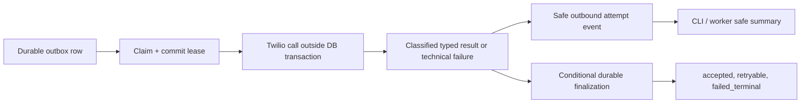

# Design: observable outbound provider delivery

## Decision

Keep the current durable state machine and status-based Twilio retry policy.
Add one dispatcher-owned, sanitized attempt event and propagate its aggregate
through the existing outbound CLI and automatic worker. This is observation,
not a second delivery pipeline or a policy rewrite.

## Safe event contract

Every completed dispatch attempt emits one event named
`provider_outbound_attempt`. Its allowlisted fields are:

| Field | When present |
| --- | --- |
| `outcome` | all results |
| `outbox_id` | claimed-row results |
| `attempt_count` | retry/terminal results |
| `durable_state` | accepted/retry/terminal results |
| `failure_category`, `provider_code` | classified failure only |
| `http_status` | known REST failure only |
| `exception_type` | technical failure only |

No other provider exception data is allowed. In particular, do not use
`str(exc)`, tracebacks, message text, addresses, URLs, credentials or payloads.

The CLI prints/records the same safe result per attempt. The worker reports
safe aggregate counts by outcome and failure category for each cycle; it does
not depend only on the CLI exit code.

## Outcome handling

| Signal | Existing durable decision | New observation |
| --- | --- | --- |
| SDK returns SID | `accepted` | accepted event |
| typed retryable result | `retryable` with current bounded backoff | category/code/status event |
| typed terminal result or exhausted budget | `failed_terminal` | category/code/status terminal event |
| unclassified exception | no fabricated finalization; normal lease recovery | technical event with exception class |
| no due row | unchanged | safe no-work event/aggregate |

Twilio provider code is captured whenever the SDK exposes it, including future
codes. It supplements the already-authoritative HTTP classification; a code
does not alter retry behavior unless a later approved specification says so.

## Preserved boundaries

- Outbox receipt/sequence uniqueness remains the duplicate-delivery prevention
  boundary for inbound replay.
- The coordinator remains the owner of inbound/business transaction work.
- The dispatcher retains claim/finalize ownership and lease-token conditional
  finalization; the network call is outside SQLAlchemy.
- Worker and CLI delegate to existing dispatch seams only.
- Callback state transitions remain signed and monotonic.

## Focused tests

- accepted, retryable and terminal Twilio SDK outcomes each produce exactly one
  sanitized event with only allowed fields;
- REST results preserve HTTP classification while recording safe code/status;
- transport and unknown technical errors record category or exception class
  without raw exception content;
- CLI and worker surface terminal/retry evidence and aggregate counts;
- duplicate staging, accepted-no-resend, callback monotonicity and lease-lost
  protections remain unchanged.
