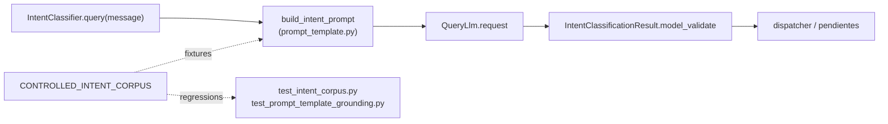

# Design: calibrate order-observation vs delivery-method boundary

## Design decision

Add one numbered rule to the existing `_RULES` block in
`backend/diagnostics/prompt_template.py` and four contrastive
few-shot examples to the existing `_EXAMPLES` block. Bump
`PROMPT_TEMPLATE_VERSION` from `intent-classifier/v1.2.0` to
`intent-classifier/v1.3.0` and `CORPUS_VERSION` from
`intent-corpus/v1.1.0` to `intent-corpus/v1.2.0`, and add the four
boundary cases as new controlled fixtures that pin exactly one intent
and the literal substring currently emitted by the classifier.

The static rule is written so that the existing contract keeps the same
shape:

- it is enumerated like the existing rules 1-7;
- it references intent names that already exist in the catalog;
- it does not introduce a new intent, a new field, or a new dispatch
  path;
- it does not require any change in
  `backend/llm/intent_classifier.py`, the schemas, the dispatcher,
  pending context, persistence, observations, mapper, outbox,
  transactions, product recognition, migrations, endpoints, workers,
  Railway configuration, or deploy.

The four contrastive examples are appended to `_EXAMPLES` after the
existing `modificar_producto` example so the prompt order
(`Catálogo` → `Reglas` → `Ejemplos` → `Estructura de salida` →
`Mensaje actual`) is preserved. The substring-literal contract, the
`no reutilices` / `no inventes` instructions, the `una única acción` →
`exactamente un intent` rule, the existing
`ver_metodos_de_entrega` example, and the existing
`set_observacion_pedido` example are preserved verbatim.



The diagram is descriptive only; no code outside the four allowed
files is changed.

## Boundary rule text (numbered rule 8)

Appended to `_RULES` after rule 7:

```
8. Distinguí explícitamente `set_metodo_de_entrega` de `set_observacion_pedido` cuando el mensaje mencione la palabra "entrega":
   * Usá `set_metodo_de_entrega` ÚNICAMENTE cuando el cliente selecciona o cambia la MODALIDAD de recepción (delivery / envío a domicilio, retiro por el local, consumo en salón). Verbos característicos: "quiero envío a domicilio", "lo paso a retirar", "lo retiro por el local", "lo voy a comer ahí", "que sea para llevar".
   * Usá `set_observacion_pedido` para instrucciones GENERALES de entrega, acceso, ruta, portón, timbre, edificio, seguridad, mascotas, cuidado o cualquier indicación operativa, aunque aparezca la palabra "entrega". Verbos característicos: "la entrega es por el portón lateral", "tocar timbre", "dejar en la puerta", "cuidado con el perro", "es un edificio con portero".
   En la duda, si el mensaje describe CÓMO / CUÁNDO / DÓNDE entregar o información del destinatario y no la MODALIDAD de recepción, clasificá como `set_observacion_pedido`. La palabra "entrega" por sí sola no implica `set_metodo_de_entrega`.
```

This text is a numbered rule (matching the existing style) and
references the existing catalog intent names without introducing any
new intent name or field.

## Contrastive example block (appended to `_EXAMPLES`)

Each example uses the same `Mensaje:` / `Salida:` / fenced-JSON shape
as the existing examples. Every `mensaje` field is a verbatim
substring of the customer message:

```
Mensaje:
`La entrega es por el portón lateral`

Salida:
```json
{
  "intents": [
    {
      "intent": "set_observacion_pedido",
      "mensaje": "La entrega es por el portón lateral"
    }
  ],
  "mensaje": "La entrega es por el portón lateral"
}
```


Mensaje:
`Cuidado con el perro`

Salida:
```json
{
  "intents": [
    {
      "intent": "set_observacion_pedido",
      "mensaje": "Cuidado con el perro"
    }
  ],
  "mensaje": "Cuidado con el perro"
}
```


Mensaje:
`Quiero envío a domicilio`

Salida:
```json
{
  "intents": [
    {
      "intent": "set_metodo_de_entrega",
      "mensaje": "Quiero envío a domicilio"
    }
  ],
  "mensaje": "Quiero envío a domicilio"
}
```


Mensaje:
`Lo retiro por el local`

Salida:
```json
{
  "intents": [
    {
      "intent": "set_metodo_de_entrega",
      "mensaje": "Lo retiro por el local"
    }
  ],
  "mensaje": "Lo retiro por el local"
}
```

The two `set_observacion_pedido` examples deliberately appear before
the two `set_metodo_de_entrega` examples so the `Mensaje: la entrega
es por el portón lateral` case is read first — the prompt places the
example that mentions "entrega" but routes to the observation intent
before the example that mentions the same word and routes to the
modality intent.

## Corpus fixtures

Append the four boundary cases to `CONTROLLED_INTENT_CORPUS` after
the existing `F-SET_METODO_DE_ENTREGA` fixture. Each fixture pins the
same `message` as the customer query and the expected single intent:
`SET_OBSERVACION_PEDIDO` for the first two and
`SET_METODO_DE_ENTREGA` for the last two. No `expected_source_fragments`
are needed — each `message` is itself the substring the classifier must
emit, which `test_every_fixture_message_is_present_in_its_rendered_prompt`
already enforces.

Fixture IDs follow the existing regression style
(`F-REG-<slug>`):

- `F-REG-OBSERVACION_PEDIDO-PORTON_LATERAL`
- `F-REG-OBSERVACION_PEDIDO-MASCOTAS`
- `F-REG-METODO_DE_ENTREGA-ENVIO_DOMICILIO`
- `F-REG-METODO_DE_ENTREGA-RETIRO_LOCAL`

## Focused tests

Append the following assertions; do not modify any existing assertion.

`backend/tests/test_intent_corpus.py` (extend
`ControlledCorpusShapeTest`):

- one assertion per fixture ID above that pins
  `expected_intents == (SET_OBSERVACION_PEDIDO,)` or
  `(SET_METODO_DE_ENTREGA,)` and that the customer `message` is a
  substring of itself (trivial but explicit, matching the existing
  style of `test_payment_regression_fixture_pins_single_intent`).

`backend/tests/test_prompt_template_grounding.py`:

- one assertion per boundary message inside
  `SecondPromptCorrectionStructureTest` (or a sibling class with the
  same fixtures name) that the rendered prompt contains both the
  message and the corresponding intent name; this mirrors the
  existing `test_short_examples_for_each_failure_case_are_present`.
- one structural assertion that the rendered prompt documents the
  new rule (e.g. contains the substring "set_observacion_pedido" and
  "set_metodo_de_entrega" inside the same numbered rule context).
- one assertion that the existing
  `test_template_version_bumped_for_second_correction` (or its
  replacement) pins `PROMPT_TEMPLATE_VERSION == "intent-classifier/v1.3.0"`.

No new public surface, no new module, no new dependency.

## Authoritative outcomes

| Situation | Required outcome | Must not happen |
| --- | --- | --- |
| `La entrega es por el portón lateral` | rendered prompt contains the message + `set_observacion_pedido` + the new rule 8; audit fixture pins single `SET_OBSERVACION_PEDIDO` | second LLM call, keyword heuristic, generic `set_metodo_de_entrega` for this message |
| `Cuidado con el perro` | rendered prompt contains the message + `set_observacion_pedido` + the new rule 8; audit fixture pins single `SET_OBSERVACION_PEDIDO` | second LLM call, keyword heuristic |
| `Quiero envío a domicilio` | rendered prompt contains the message + `set_metodo_de_entrega` + the new rule 8; audit fixture pins single `SET_METODO_DE_ENTREGA` | over-correction toward `set_observacion_pedido` |
| `Lo retiro por el local` | rendered prompt contains the message + `set_metodo_de_entrega` + the new rule 8; audit fixture pins single `SET_METODO_DE_ENTREGA` | over-correction toward `set_observacion_pedido` |
| Template body change | `template_fingerprint()` SHA-256 changes automatically; `ClassifierCallStarted` / `ClassifierCallCompleted` continue to expose the static fingerprint, never the rendered prompt | leaking customer message or rendered prompt into runtime diagnostics |

The four prompts above are the only boundary cases added in this phase.
Other modality-vs-observation boundaries (third-party transfer, neighbour
reception, fragment ambiguity) are deferred.

## Ordering, privacy, and limitations

The four new examples are placed after the existing
`modificar_producto` example, after the catalog and rules, and before
the output structure. The customer message remains the last section of
the prompt. The `ClassifierCallStarted` / `ClassifierCallCompleted`
diagnostic events still expose only `template_fingerprint()`,
`PROMPT_TEMPLATE_VERSION`, the validated intent names/count, the
effective model, and the validation category. The customer message and
the rendered prompt are still never logged or persisted.

This phase does not:

- introduce a runtime fallback if the classifier still returns
  `set_metodo_de_entrega` for an observation message — that signal is
  observed by the controlled audit only;
- widen or shift the pending candidate set;
- change the dispatcher, schema, persistence, or transport.
