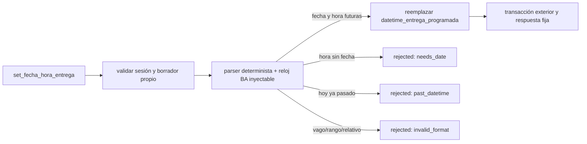
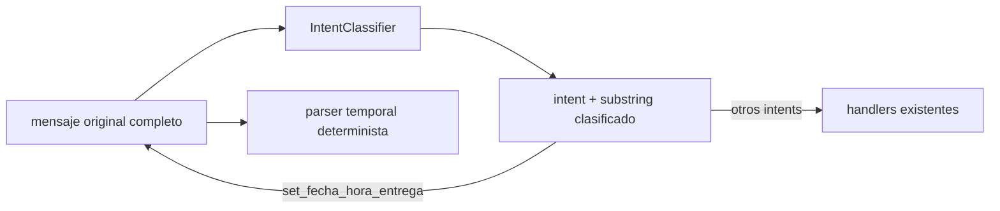

# Design: expresiones temporales españolas acotadas

El parser será una función privada, determinista y testeable. Recibe `source_text` y un `now` timezone-aware (o una función reloj) en `America/Argentina/Buenos_Aires`; devuelve un datetime aware más una etiqueta segura de forma, o una razón de negocio. No llama LLM, librerías NLP ni servicios externos.

Primero conserva los dos formatos absolutos exactos actuales. Para español, normaliza solamente para reconocer vocabulario temporal, preservando el texto original fuera del reconocimiento. Identifica como máximo un fragmento con el patrón semántico fecha (`hoy`, `mañana` o `el` opcional + día de semana) + `a las` + hora `H`/`H:MM` y opcional `horas`/calificador. La hora 0–23 sin calificador es válida; la hora 1–12 con `mañana` se mantiene, `tarde` suma 12 para 1–11 y `noche` convierte 1–11 a 13–23. `12 de la mañana` se rechaza por ambiguo; `12 de la tarde` se interpreta 12:xx. El parser exige minuto 0–59 y no acepta `24`.

Para `hoy` y `mañana` se calcula el date local desde el mismo `now`. Para un día semanal se calcula la siguiente fecha cuyo weekday corresponda, usando hoy sólo si el datetime completo es futuro. Si el resultado es igual o anterior a `now`, retorna `past_datetime`; no se desplaza un `hoy` pasado a mañana. Una hora con `a las` y sin fecha retorna `needs_date`, incluso con `de la noche`.

El orden del handler permanece: sesión activa; `session.id_pedido`; `db.get(Pedido, session.id_pedido)`; `pedido.id_session == session.id`; `BORRADOR`; parseo; futuro; única asignación. La comparación y el parser usan exactamente el mismo reloj inyectado para prevenir flakes de borde. Ningún branch toca estado de sesión/contexto, candidatos o requisitos de confirmación.

Las respuestas fijas se seleccionan por `reason`: `needs_date` pide una fecha concreta junto con el horario; `past_datetime` pide un horario futuro; `invalid_format` indica que se use hoy/mañana/día de semana más una hora concreta. No repiten entrada ni datetime. Éxito conserva el mensaje actual. El mapper no requiere branch adicional porque ya enruta el intent a este builder y comparte el resultado entre ruta local y outbox.

| Condición | Outcome | Escritura |
| --- | --- | --- |
| Boundary de sesión/pedido falla | `rejected` / razón existente | Ninguna |
| Fecha y hora admitidas, futuras | `executed` / etiqueta segura | Sólo datetime |
| Hora sin fecha | `rejected` / `needs_date` | Ninguna |
| Fecha resuelta ya pasada | `rejected` / `past_datetime` | Ninguna |
| Vaga, rango, duración, recurrencia, relativa no admitida o ambigua | `rejected` / `invalid_format` | Ninguna |
| Error técnico de DB/código | excepción propagada | Owner exterior hace rollback |

El cambio no crea pending context: la aclaración es una respuesta terminal del turno. Por ello una respuesta siguiente con fecha/hora completa se volverá a clasificar por la ruta normal; esa es una limitación explícitamente diferida, no una segunda pipeline.

## Subfase de regresión: boundary de fuente clasificada

`ClassifiedIntent.mensaje` tiene el propósito de segmentar acciones y sólo se obliga a ser un substring literal. Para programación temporal, esa segmentación puede cortar datos necesarios de una expresión compuesta. El dispatcher conserva clasificación y orden, pero para este único intent cambia el payload entregado al handler por el `message` original ya validado al inicio del turno.

No se reconstituye texto ni se consulta LLM por segunda vez. El handler sigue siendo la autoridad de parseo y continúa rechazando cero o más de un fragmento temporal. En los demás branches, `classified.mensaje` se mantiene idéntico; así no se crea una pipeline paralela ni se altera la semántica de productos, dirección u observaciones.
