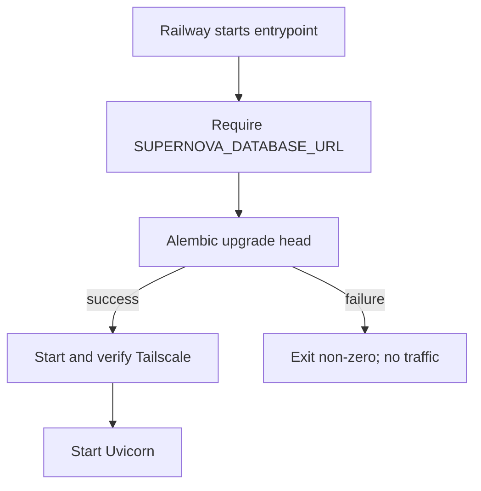

# Design: entrypoint migration gate for Railway

## Decision

Use the existing `docker-entrypoint.sh` as the single migration authority for
the Railway web service. Immediately after the existing required-variable
checks, it invokes the installed Alembic module against
`SUPERNOVA_DATABASE_URL`. Only a zero exit permits the current Tailscale
readiness sequence and, later, Uvicorn startup.

`railway.toml` no longer declares `preDeployCommand`. The current pre-deploy
and the entrypoint must not coexist as independent migration paths. This puts
the successful migration and the web server in one directly observable process
order without changing Alembic configuration or application business code.

## Startup and failure semantics

The command is `python -m alembic upgrade head`, executed from `/app`, the
same image that contains `alembic.ini`, `backend/alembic`, installed
dependencies, and the web application. `set -e` propagates a failed command;
the implementation adds a safe explicit failure marker only if needed without
masking the exit code. It must not catch and continue.

Alembic's migration transaction remains its own. The entrypoint starts no
database transaction and does not alter the URL normalization performed in
`backend/alembic/env.py`. A restart against the current revision invokes the
same idempotent Alembic command; it is not a second code path or a fallback.

The migration precedes Tailscale intentionally. PostgreSQL is direct Railway
private networking, whereas only Ollama calls depend on the loopback SOCKS5
proxy. Thus the migration gate neither depends on Tailscale availability nor
changes its existing timeout/supervision contract.

## Boundary preservation

The entrypoint remains responsible for deployment prerequisites and child
process supervision only. It does not access orders, sessions, recognizers,
webhooks, provider queues, or message payloads. `/health` remains a liveness
endpoint; the operational revision command remains the database-readiness
evidence rather than adding DB work to health checks.

No product-recognition, commerce isolation, pending candidate, confirmation,
or cancellation boundary changes. The provider worker's pre-Uvicorn validation
continues after the migration gate and retains its own enabled/disabled
behavior.

## Focused test design

- Assert the manifest has no `preDeployCommand` and retains the existing
  Dockerfile/start/health configuration.
- Assert the entrypoint requires the production URL and places the Alembic
  command before both `tailscaled` and Uvicorn.
- Assert shell syntax remains valid.
- Exercise a safe mocked/controlled failure seam only if the existing test
  structure can do so without launching Tailscale; prove Uvicorn cannot be
  reached after migration failure.
- Preserve the current worker-entrypoint tests to ensure its validation and
  supervision remain ordered after the new gate.

## Deployment verification

The implementation report must include the user-run local validation output.
Only after separate production-deploy authorization, Railway evidence consists
of a successful deploy, safe migration lifecycle logs, `python -m alembic
current` reporting the image revision, and `GET /health` returning 200. A
successful build, config parsing, or liveness response alone is insufficient.
