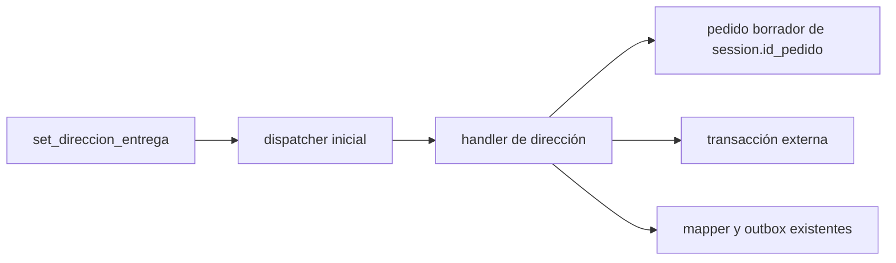

# Design: dirección de entrega del pedido borrador

## Decisión

Agregar `Pedido.direccion_entrega` nullable y reutilizar el cierre de pedido borrador. El texto clasificado completo es el valor: no se extraen componentes ni se infiere método de entrega.

## Persistencia y aislamiento

La revisión usa `down_revision = b0c1d2e3f4a5` y agrega sólo `pedidos.direccion_entrega TEXT NULL`: sin backfill, defaults, índices ni constraints. El handler reemplaza el valor sin tocar método, pago, observaciones, líneas, sesión, pendientes ni estado.

Exige sesión activa, carga sólo `session.id_pedido`, verifica propiedad y estado `borrador`. La transacción exterior conserva commit y rollback. La confirmación sigue requiriendo líneas, pago y método; la dirección no altera esos requisitos.

## Respuesta y errores

Éxito: `Listo, guardé la dirección de entrega.` sin eco. Rechazos de negocio no mutan. Errores técnicos conservan la respuesta técnica existente. El mapper recibe branch explícito para eliminar el fallback genérico.

## Tests focalizados

- Forma de modelo/migración e independencia de observaciones.
- Normalización, reemplazo, límites y preservación en rechazo.
- Aislamiento sesión/borrador y ausencia de mutaciones colaterales.
- Dispatcher, mapper sin dirección expuesta, rollback exterior y ausencia de operaciones transaccionales del handler.
