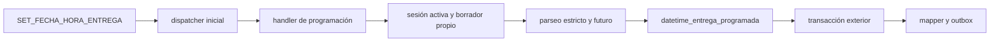

# Design: fecha y hora de entrega

El parser privado y testeable acepta únicamente `DD/MM/YYYY HH:MM` y `YYYY-MM-DD HH:MM`, sin texto adicional. Con `strptime` construye un datetime y le asocia `ZoneInfo("America/Argentina/Buenos_Aires")`; exige que sea futuro frente al reloj de esa zona. No agrega dependencias ni interpreta lenguaje relativo, offsets o timezone del mensaje.

Orden de validación: sesión activa; `session.id_pedido`; carga directa por id; `pedido.id_session == session.id`; `BORRADOR`; parseo y futuro. La única escritura es `pedido.datetime_entrega_programada = parsed_datetime`. No crea pending state ni toca otros campos. Confirmar pedido conserva sus requisitos actuales; programación no pasa a ser requisito.

Éxito: `Listo, guardé la fecha y hora de entrega.` Rechazo: respuesta fija sin fecha/hora ni texto recibido. `resolved_data` usa sólo `accepted_format` (por ejemplo, `dd/mm/yyyy_hh:mm`) o una `reason` estable; nunca almacena el datetime completo. La operación HTTP existente queda fuera del camino conversacional.

No hay migración: el campo ya existe en el baseline productivo y en la base actual de `origin/main`.

## Outcomes, fallback y transacción

| Condición | Outcome | Efecto persistido |
| --- | --- | --- |
| Sesión inactiva | `rejected` / `session_not_active` | Ninguno |
| Sin `session.id_pedido` o fila ausente | `rejected` / `no_draft` | Ninguno |
| Pedido de otra sesión | `rejected` / `session_mismatch` | Ninguno |
| Pedido distinto de `borrador` | `rejected` / `pedido_not_borrador` | Ninguno |
| Formato no exacto, incompleto, relativo, ambiguo o inválido | `rejected` / `invalid_format` | Conserva el valor previo |
| Datetime válido pero pasado en la zona autoritativa | `rejected` / `past_datetime` | Conserva el valor previo |
| Datetime válido y futuro | `executed` / `accepted_format` | Reemplaza sólo `datetime_entrega_programada` |

Errores de base de datos, mapeo o programación son fallas técnicas: no se convierten a un outcome de negocio y se propagan a `process_incoming_message_transactional` o `ProviderInboundMessageCoordinator.process_lease`, que conservan el rollback del turno completo.

No hay fallback: el handler no usa Fuzzy, LLM, parsing de lenguaje natural, búsqueda de otro pedido ni retry. Un rechazo no se reinterpreta como observación, dirección, productos, pago, método de entrega, confirmación o cancelación, ni crea/modifica contexto o candidatos pendientes. La prioridad existente de un contexto pendiente se mantiene en el dispatcher.
