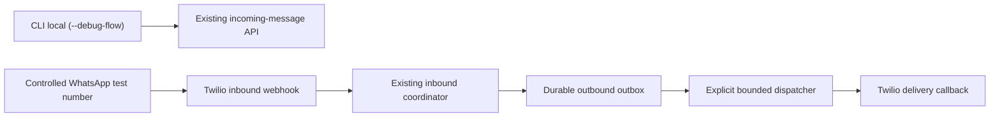

## Decision

This is an operational pilot change with one small internal setup
implementation; the existing message runtime is exercised without bypasses:



The CLI and WhatsApp tracks complement one another. CLI makes product and
pending-context behavior inspectable before live delivery; WhatsApp proves the
provider boundary and persisted outbound delivery path. Neither is a substitute
for the other.

## Routing provisioning and verification

The existing `/clientes` HTTP surface is not used for this pilot setup: it
returns the client WhatsApp field and owns a separate transaction, while no
equivalent `CanalWhatsapp` route exists. The approved implementation is one
internal CLI, `backend.cli.provision_whatsapp_pilot_routing`, backed by a
small service boundary and the existing repositories/services. It is neither a
webhook nor a message-processing pipeline.

Its input is only: the selected internal test-client E.164, the numeric pilot
commerce ID, and the already-configured `TWILIO_OUTBOUND_SENDER_E164`. The
sender setting is the canonical source of the destination; it is not repeated
as a CLI argument. The command rejects an absent/invalid sender configuration
and validates the supplied client number with the existing canonical E.164
channel normalization before querying or mutating.

`--verify-only` is the default and performs no mutation. `--apply` is explicit
and is idempotent for the exact intended state. It creates an absent client as
active, or reactivates the exact existing client only when the operator supplies
a dedicated acknowledgement. It creates a channel only when no channel history
exists for that provider/destination. It does not reactivate, reassign, replace
or delete an existing channel.

The command must end with `CommerceChannelResolver.resolve_dedicated("twilio",
sender)` and succeeds only for `RESOLVED` with the requested commerce. Its
sanitized result includes mode, status, whether a client/channel was created
or reactivated, and numeric internal IDs. It must never print, log, serialize
or include in an exception: either E.164 input, the sender setting, raw
message content, credentials, signatures or database URLs.

| Condition | `--verify-only` | `--apply` | Result |
| --- | --- | --- | --- |
| Active exact client; active dedicated exact channel; resolver exact | no mutation | no mutation | `ready` |
| One or both required records are absent; no channel history; commerce active | `not_ready` | stage only missing active client and/or dedicated channel; commit once | `provisioned` |
| Client inactive; no channel history; explicit reactivation acknowledgement | `not_ready` | reactivate client and stage a missing channel if needed; commit once | `provisioned` |
| Client inactive without acknowledgement | `not_ready` | no mutation | `inactive_client_requires_acknowledgement` |
| Channel has different mode/commerce, is inactive, or resolver is not exact | `not_ready` | no mutation | typed configuration failure |
| Inactive/missing commerce, invalid input/configuration, duplicate/race, or DB error | `not_ready` or error | roll back all staged state | typed error / technical failure |

The CLI is the sole owner of one setup transaction. Its service/repository
helpers stage state without `commit`, `rollback`, `begin` or `flush`; the CLI
may flush once to expose the staged state to its final resolver check, then
commits once or rolls back on every exception. The CLI redacts caught exception
text rather than printing exception messages that could contain an address. No
inbound, recognition, outbox, dispatcher or callback component is invoked.

## Pilot boundary

- One active commerce, configured by the user, and only designated internal
  test customer numbers participate.
- Cases are hand-authored opaque IDs. The operator records categories and safe
  identifiers, never the raw messages or personal data.
- Outbound messages are sent only by an explicit command run with a bounded
  `--max-attempts-per-pass` value. There is no worker, cron or retry loop.
- A failed prerequisite stops progression to the next track. Failures never
  trigger direct database edits, direct Twilio calls outside the dispatcher,
  catalog widening, or a fallback model/provider.

## Manual acceptance matrix

| Track | Required evidence | Pass condition |
| --- | --- | --- |
| Deployment | release ID, Alembic revision, `/health` status | Expected revision and 200 health response |
| Ollama | sanitized integrated probe summary | `generate=passed`, `embed=passed`, dimension 384 |
| CLI happy path | case ID, response/status, order-table outcome | Existing order mutation succeeds as expected |
| CLI ambiguity | case ID, diagnostic component/status only | Clarification remains restricted; resolution succeeds or stays safely pending |
| Routing readiness | sanitized CLI status, numeric IDs and resolver status | Exact active client and dedicated Twilio channel resolve to the pilot commerce; no E.164/message content exposed |
| WhatsApp inbound | safe receipt ID and route result | Exactly one first processing for valid receipt; duplicate is a safe no-op |
| Dispatch | pass bound, counters, safe outbox/SID | Only due rows are handled by explicit pass |
| Callback | safe SID/state transition | Valid signed callback advances monotonically or is a documented no-op |

## Commands for the user’s local terminal

Run these only in the supported local environment; share the complete output
with Codex for review:

```bash
PYTHONPATH=. venv/bin/pytest -q backend/tests/test_whatsapp_pilot_routing_provisioning.py backend/tests/test_commerce_channel_resolver.py backend/tests/test_twilio_webhook.py backend/tests/test_run_outbound_dispatch_cli.py
PYTHONPATH=. venv/bin/python -m ruff check backend/cli/provision_whatsapp_pilot_routing.py backend/services/whatsapp_pilot_routing_provisioning_service.py backend/repositories/cliente_repository.py backend/tests/test_whatsapp_pilot_routing_provisioning.py
PYTHONPATH=. venv/bin/python -m compileall backend/cli/provision_whatsapp_pilot_routing.py backend/services/whatsapp_pilot_routing_provisioning_service.py backend/repositories/cliente_repository.py backend/tests/test_whatsapp_pilot_routing_provisioning.py
openspec validate run-controlled-whatsapp-pilot-7-1 --strict
git diff --check
```

The CLI is started against an operator-selected safe base URL, for example:

```bash
INCOMING_MESSAGES_BASE_URL=http://127.0.0.1:8000 PYTHONPATH=. venv/bin/python -m backend.scripts.cli_chat_client --debug-flow
```

For the deployed service, follow the existing Railway runbook for `alembic
current` and `check_railway_ollama_contracts`. Run the approved CLI once in
its default verification mode; after reviewing the sanitized not-ready status,
run it once with explicit apply only if required, then run verification again.
After a `ready` result, send one approved inbound case and run exactly one
manual dispatcher pass with `--max-attempts-per-pass 1`. Do not paste secrets,
E.164 values, raw request bodies or generated content into the terminal report.

## Exit decision

The pilot is ready to recommend the next functional phase only when every
applicable matrix row passes, no invariant is violated, and the user accepts
the evidence. A product-recognition failure creates a scoped recognition
follow-up; an unsupported confirmation/payment/delivery interaction becomes
input for the subsequent order-closure proposal. Neither authorizes a fix
inside this change.
